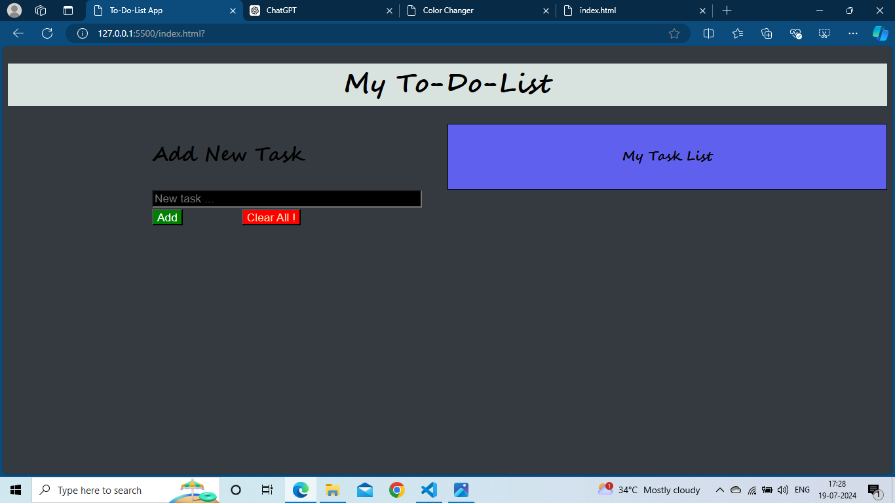
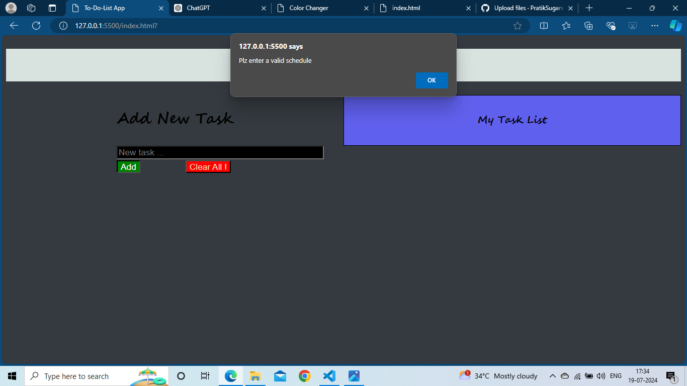
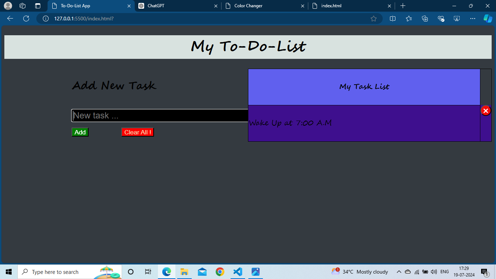
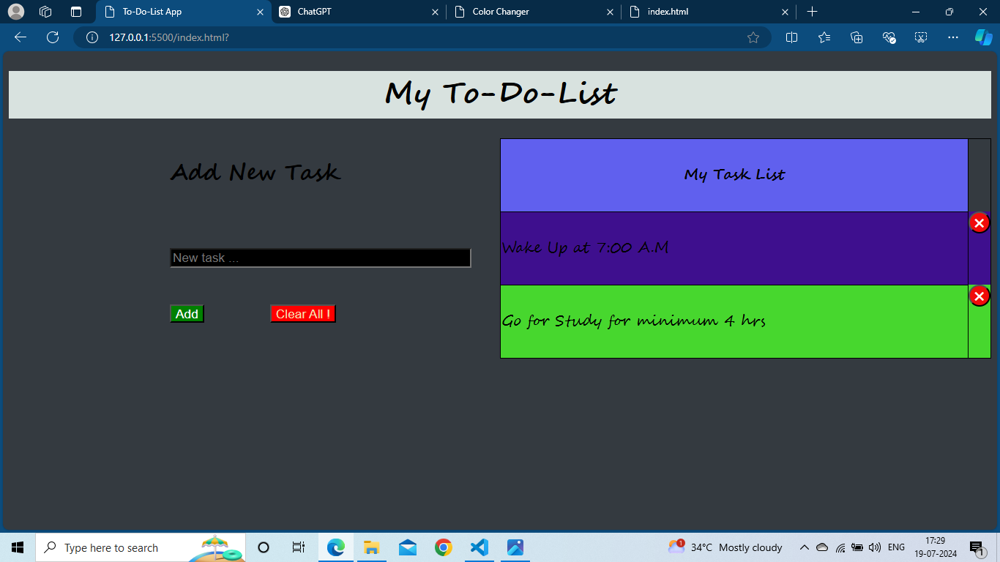
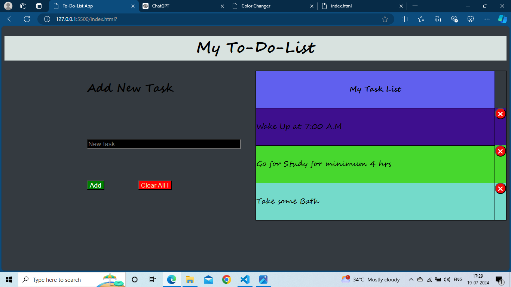
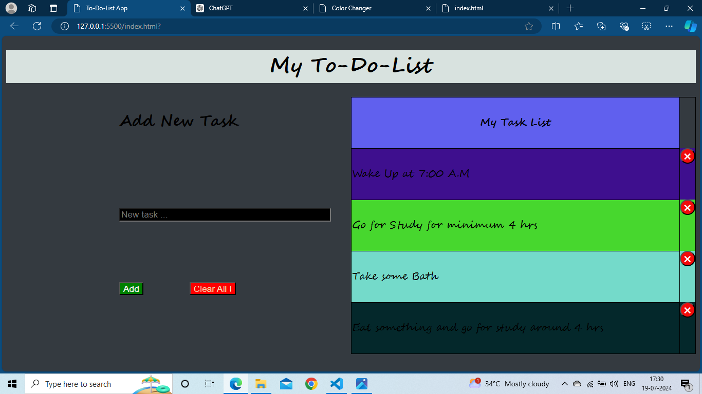
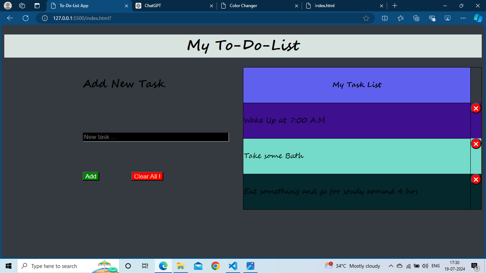

# Todo List App
This is a simple todo list application where users can enter tasks, display them in a table format with each task displayed in a row with different colors, and manage tasks using an intuitive interface.

# Features 
1. Add Tasks: Enter tasks into the input field and click "Add Task" to add them to the todo list.
2. Remove Tasks: Each task row includes a cross button. Clicking the cross button removes the corresponding task from the list.
3. Clear All Tasks: Click "Clear All" to remove all tasks currently displayed in the placeholder input field.
4. Dynamic Styling: Tasks are displayed in a table with alternating row colors for better readability.
5. Responsive Design: The app is designed to work well on various screen sizes
